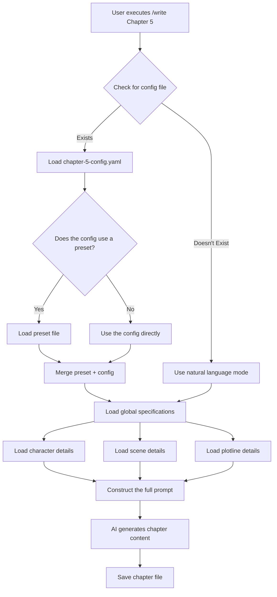

# Chapter Configuration System PRD

## Document Information

- **Product Name**: Chapter Configuration System
- **Version**: v1.0.0
- **Creation Date**: 2025-10-14
- **Owner**: Novel Writer Team
- **Status**: Design Phase

---

## 1. Background and Problem Analysis

### 1.1 Current Situation Analysis

**novel-writer-cn current architecture**:

```
Global Specification System (✅ Well-established):
├── memory/novel-constitution.md      # Writing Constitution
├── stories/*/specification.md        # Story Specification
├── spec/tracking/
│   ├── character-state.json         # Character State Tracking
│   ├── relationships.json           # Relationship Network
│   ├── plot-tracker.json            # Plot Tracker
│   └── timeline.json                # Timeline
└── spec/knowledge/
    ├── character-profiles.md        # Character Profiles
    ├── world-setting.md             # World Setting
    └── locations.md                 # Location Library

Chapter Writing Flow (❌ Needs Optimization):
User inputs in the AI editor:
/write Chapter 5

Key points for this chapter:
- Appearing characters: Lin Chen, Su Wan
- Scene: Company meeting room
- Emotion: Tense
- Plot type: Ability showcase
- Style: Fast-paced, mainly short sentences
- Word count: 3000 words
```

**Problem Identification**:

1.  **Parameter Expression**: Purely natural language, which the AI needs to parse, leading to potential omissions or misunderstandings.
2.  **Repetitive Configuration**: Similar scenes (e.g., multiple action chapters) require repetitive descriptions.
3.  **Consistency Assurance**: Relies on the user's memory to maintain style consistency, which can easily lead to deviations.
4.  **Configuration Barrier**: The need to think through all parameters every time increases the cognitive load.
5.  **Lack of Reusability**: Previous configurations cannot be quickly applied to new chapters.

### 1.2 Competitive Analysis: Star Moon Writing Platform

**The Star Moon approach**:

```
Web Form Interface:
┌─────────────────────────┐
│ Chapter No.: [5]        │
│ Title: [First Showcase] │
│                         │
│ Appearing Characters: (Multi-select) │
│  ☑ Lin Chen (Protagonist)     │
│  ☑ Su Wan (Female Lead)     │
│  ☐ Zhang Wei (Colleague)      │
│                         │
│ Scene: (Dropdown)       │
│  [Office-Meeting Room ▼]  │
│                         │
│ Quick Preset: (Optional)  │
│  [Ability Showcase Scene ▼] │
│  [Apply Preset]         │
│                         │
│ [Generate Chapter]      │
└─────────────────────────┘
```

**Advantage Analysis**:

✅ **Structured Input**: Dropdowns, checkboxes make parameters clear.
✅ **Lower Barrier to Entry**: No need to think through all details every time.
✅ **Preset System**: Quick options for common scenes (action, romance, etc.).
✅ **Visualization**: What you see is what you get.

**Disadvantage Analysis**:

❌ **Weak Consistency**: No global specification system, relies on human memory.
❌ **No Tracking**: Lacks character state and relationship network tracking.
❌ **No Traceability**: Historical configurations cannot be viewed.
❌ **Instant-Oriented**: Each writing session is independent, with no overall planning.

### 1.3 The Core Gap

**The gap is not in feature completeness, but in the input method**:

| Dimension | novel-writer-cn | Star Moon Writing Platform | The Gap |
|---|---|---|---|
| Global Specification | ✅ specification.md | ❌ None | We are stronger |
| Character Tracking | ✅ character-state.json | ❌ None | We are stronger |
| Relationship Network | ✅ relationships.json | ❌ None | We are stronger |
| Timeline Management | ✅ timeline.json | ❌ None | We are stronger |
| **Chapter Parameter Input** | ❌ **Natural Language** | ✅ **Structured Form** | **This is the gap** |
| Preset Templates | ❌ None | ✅ Yes | Missing feature |

**Conclusion**: We don't lack global configuration; we lack **structured management for chapter-level parameters**.

---

## 2. Product Goals

### 2.1 Core Goals

**Goal 1: Lower the configuration barrier for chapter writing**
-   Shift from "thinking through all parameters every time" to "quickly selecting/reusing configurations".
-   Reduce user configuration time by 50%.

**Goal 2: Maintain the Specification-Driven philosophy**
-   Enhance, not replace, the existing system.
-   Chapter Config = Global Spec + Chapter Params.
-   Configuration files can be tracked and version-controlled with Git.

**Goal 3: Establish a preset ecosystem**
-   Provide official presets (action scenes, emotional scenes, etc.).
-   Support user-defined presets.
-   Enable community sharing of presets.

### 2.2 Non-Goals

❌ **Not**: Replacing the global specification system (`specification.md`, etc.).
❌ **Not**: Requiring a configuration file for every chapter.
❌ **Not**: Forcing the use of a web interface.
❌ **Not**: Changing the philosophy of Specification-Driven Development.

### 2.3 Success Metrics

**Quantitative Metrics**:
-   Chapter configuration creation time < 2 minutes (vs. current 5-10 minutes).
-   Configuration reuse rate > 30% (reusing configs for similar chapter types).
-   Preset usage rate > 40% (using official or community presets).
-   User satisfaction > 4.5/5.0.

**Qualitative Metrics**:
-   User feedback: "Configuration is much more convenient."
-   Reduced onboarding time for new users.
-   Improved creative continuity (thought process is not interrupted by configuration).

---

## 3. User Scenarios

### 3.1 Scenario 1: Quickly Create a Chapter Configuration (Interactive CLI)

**User Role**: Author Zhang San, currently writing Chapter 5.

**Workflow**:

```bash
# Step 1: Create a configuration interactively via CLI
$ novel chapter-config create 5 --interactive

┌─ 📝 Chapter Configuration Wizard ──────────────┐
│ Chapter Number: 5                             │
│ Title: [Input] First Glimmer of Talent        │
│                                               │
│ Select Appearing Characters (Space to select, Enter to confirm):   │
│  [x] Lin Chen (Protagonist - Male - 24)       │
│  [x] Su Wan (Female Lead - Female - 26)       │
│  [ ] Zhang Wei (Colleague - Male - 28)        │
│                                               │
│ Select Scene:                                 │
│  ( ) Office - Desk                            │
│  (*) Office - Meeting Room                    │
│  ( ) Cafe                                     │
│                                               │
│ Atmosphere/Mood:                              │
│  (*) Tense     ( ) Relaxed                    │
│  ( ) Sad       ( ) Exciting                   │
│                                               │
│ Plot Type:                                    │
│  (*) Ability Showcase   ( ) Relationship Development │
│  ( ) Conflict           ( ) Foreshadowing          │
│                                               │
│ Writing Style:                                │
│  (*) Fast-paced     ( ) Detailed Description   │
│  ( ) Dialogue-heavy ( ) Narrative-driven      │
│                                               │
│ Target Word Count: [━━━━━●──] 3000 words        │
│                                               │
│ [Confirm] [Cancel]                            │
└───────────────────────────────────────────────┘

✅ Configuration saved to: stories/my-story/chapters/chapter-5-config.yaml
```

**Generated Configuration File**:

```yaml
# stories/my-story/chapters/chapter-5-config.yaml
chapter: 5
title: First Glimmer of Talent

characters:
  - id: protagonist
    name: Lin Chen
    focus: high    # Key character in this chapter
  - id: female-lead
    name: Su Wan
    focus: medium

scene:
  location_id: office-meeting-room
  location_name: Office - Meeting Room
  time: 10:00 AM
  atmosphere: tense

plot:
  type: ability_showcase
  summary: The protagonist solves a technical problem in a meeting, catching the female lead's attention.
  key_points:
    - Showcase programming skills
    - Catch the female lead's attention for the first time
    - Plant a clue for the villain's storyline

style:
  pace: fast
  sentence_length: short
  focus: dialogue_action

wordcount:
  target: 3000
  min: 2500
  max: 3500

created_at: 2025-10-14T10:30:00Z
```

**Step 2: Write in the AI Editor**

```
User inputs in Claude Code:
/write Chapter 5

AI automatically performs:
1. Detects that chapter-5-config.yaml exists.
2. Loads the configuration + global specs (constitution.md, specification.md, etc.).
3. Generates the chapter content based on the structured parameters.
4. Saves to stories/my-story/content/Chapter 5.md.
```

**Value**:
✅ Structured parameters lead to more accurate AI understanding.
✅ Configurations are reusable (e.g., Chapter 10 is also an ability showcase).
✅ Git trackable, making it easy to review changes.

### 3.2 Scenario 2: Use a Preset Template

**User Role**: Author Li Si, needs to write an intense fight scene.

**Workflow**:

```bash
# Step 1: View available presets
$ novel preset list --category scene

📦 Available Scene Presets:

  action-intense         Intense Action Scene
    Suitable for: Fights, chases, and other high-intensity action.
    Style: Fast-paced, short sentences, dense action descriptions.

  emotional-dialogue     Emotional Dialogue Scene
    Suitable for: Confessions, arguments, and other emotional scenes.
    Style: Dialogue-heavy, psychological descriptions, delicate emotions.

  mystery-suspense       Suspense Building Scene
    Suitable for: Mystery, investigation, and foreshadowing.
    Style: Atmosphere building, detailed descriptions, use of white space.

# Step 2: Create a configuration using a preset
$ novel chapter-config create 8 --preset action-intense

✅ Preset applied: action-intense
📝 Please fill in the chapter details:

Appearing Characters: [Input] Lin Chen, Villain A
Scene: [Input] Abandoned Factory
Plot Summary: [Input] The protagonist's first confrontation with the villain.

✅ Configuration saved to: stories/my-story/chapters/chapter-8-config.yaml
```

**Generated Configuration (Preset + User Input)**:

```yaml
chapter: 8
title: First Confrontation

# User Input
characters:
  - id: protagonist
    name: Lin Chen
    focus: high
  - id: villain-a
    name: Villain A
    focus: high

scene:
  location: Abandoned Factory
  atmosphere: tense

plot:
  summary: The protagonist's first confrontation with the villain.

# Inherited from preset
style:
  pace: fast                    # Preset: Fast-paced
  sentence_length: short        # Preset: Short sentences
  focus: action_description     # Preset: Action description

wordcount:
  target: 3000                  # Preset: 2500-3500
  min: 2500
  max: 3500

special_requirements: |         # Writing requirements from the preset
  - Mainly short sentences, 15-25 words each.
  - Dense action descriptions to highlight the impact.
  - Minimize psychological activity; focus on action.
  - Rapidly switch scenes and perspectives.

preset_used: action-intense
```

**Value**:
✅ Significantly lowers the configuration barrier; even novices can get started quickly.
✅ Ensures stylistic consistency for scenes of the same type.
✅ The community can contribute presets, forming an ecosystem.

### 3.3 Scenario 3: Reuse and Modify an Existing Configuration

**User Role**: Author Wang Wu; Chapter 15 is similar to Chapter 5 (both are ability showcases).

**Workflow**:

```bash
# Step 1: View historical configurations
$ novel chapter-config list

📋 Existing Chapter Configurations:

  Chapter 5   First Glimmer of Talent   (Ability Showcase - Office)
  Chapter 8   First Confrontation       (Action Scene - Abandoned Factory)
  Chapter 12  Deeper Exploration        (Suspense - Basement)

# Step 2: Reuse a configuration
$ novel chapter-config copy 5 15

✅ Copied configuration from Chapter 5 → Chapter 15
📝 Please modify the different parts:

Title: [First Glimmer of Talent] → [Input] Stunning the Audience
Scene: [Office - Meeting Room] → [Input] Company Annual Gala
Plot Summary: [Keep/Modify?] [Input] The protagonist showcases project results at the annual gala.

✅ Configuration saved to: stories/my-story/chapters/chapter-15-config.yaml
```

**Value**:
✅ Quickly reuse configurations for similar scenes.
✅ Save time by only modifying the differences.
✅ Maintain stylistic consistency for similar scene types.

### 3.4 Scenario 4: Writing in the AI Editor Without a Configuration (Backward Compatibility)

**User Role**: Veteran user Zhao Liu, accustomed to using natural language directly.

**Workflow**:

```
User inputs in the AI editor (without a configuration file):
/write Chapter 20

Key points for this chapter:
- Characters: Lin Chen, Su Wan
- Scene: Seaside
- Mood: Relaxed and romantic
- Plot: Confession
- Word count: 2500 words

AI executes:
1. Detects no chapter-20-config.yaml.
2. Parses the natural language description (traditional method).
3. Loads global specifications.
4. Generates the chapter content.

Optional prompt:
💡 Detected that you are using natural language for configuration. Would you like to create a structured configuration?
   $ novel chapter-config create 20 --from-prompt
```

**Value**:
✅ Fully backward compatible; does not break existing workflows.
✅ Allows optional adoption of the new feature without forcing it.
✅ Prompts users about the new feature, guiding migration.

---

## 4. Functional Design

### 4.1 Chapter Configuration File Format (YAML Schema)

#### 4.1.1 Full Schema Definition

```yaml
# Full structure of a chapter configuration file
chapter: <number>           # Chapter number (required)
title: <string>             # Chapter title (required)

# Appearing character configuration
characters:
  - id: <string>            # Character ID (references character-profiles.md)
    name: <string>          # Character name
    focus: <high|medium|low>  # Importance in this chapter
    state_changes:          # Character state changes in this chapter (optional)
      - Injured
      - Mood improves

# Scene configuration
scene:
  location_id: <string>     # Location ID (references locations.md)
  location_name: <string>   # Location name
  time: <string>            # Time (e.g., "10:00 AM", "Dusk")
  weather: <string>         # Weather (optional)
  atmosphere: <tense|relaxed|sad|exciting>  # Atmosphere

# Plot configuration
plot:
  type: <enum>              # Plot type (see enum)
  summary: <string>         # Chapter plot summary (required)
  key_points:               # Key points (array)
    - <string>
  plotlines:                # Involved plotlines (references specification.md)
    - PL-01
    - PL-02
  foreshadowing:            # Foreshadowing set in this chapter (optional)
    - id: F-005
      content: Mentions a mysterious organization

# Writing style configuration
style:
  pace: <fast|medium|slow>  # Pace
  sentence_length: <short|medium|long>  # Sentence length
  focus: <action|dialogue|psychology|description>  # Descriptive focus
  tone: <serious|humorous|dark|light>  # Tone (optional)

# Word count requirements
wordcount:
  target: <number>          # Target word count
  min: <number>             # Minimum word count
  max: <number>             # Maximum word count

# Special requirements
special_requirements: |     # Other special writing requirements (text block)
  - Requirement 1
  - Requirement 2

# Metadata
preset_used: <string>       # Preset used (optional)
created_at: <datetime>      # Creation time
updated_at: <datetime>      # Update time
```

#### 4.1.2 Plot Type Enum

```yaml
plot_types:
  - ability_showcase
  - relationship_dev
  - conflict_combat
  - mystery_suspense
  - transition
  - climax
  - emotional_scene
  - world_building
  - plot_twist
```

#### 4.1.3 Configuration File Examples

See the full examples in the `docs/prd/chapter/examples/` directory.

### 4.2 CLI Command Design

#### 4.2.1 Command List

```bash
# ========== Chapter Configuration Management ==========
novel chapter-config create <chapter>       # Create a chapter configuration
  --interactive                              # Create interactively (recommended)
  --preset <preset-id>                       # Use a preset
  --from-prompt                              # Generate from natural language

novel chapter-config edit <chapter>         # Edit a chapter configuration
  --editor <editor>                          # Specify an editor (default vim)

novel chapter-config list                   # List all chapter configurations
  --format <table|json|yaml>                 # Output format

novel chapter-config copy <from> <to>       # Copy a configuration
  --interactive                              # Interactively modify differences

novel chapter-config delete <chapter>       # Delete a configuration

novel chapter-config validate <chapter>     # Validate a configuration file

# ========== Preset Management ==========
novel preset list                           # List all presets
  --category <scene|style|chapter>           # Filter by category

novel preset show <preset-id>               # View preset details

novel preset create <preset-id>             # Create a custom preset
  --interactive                              # Create interactively

novel preset import <file>                  # Import a community preset

novel preset export <preset-id>             # Export a preset
  --output <file>                            # Output file

# ========== Configuration Template Management ==========
novel chapter-template list                 # List chapter configuration templates

novel chapter-template export <chapter>     # Export as a template
  --name <template-name>
```

#### 4.2.2 Detailed Command Design

**Command 1: `novel chapter-config create`**

```typescript
interface CreateOptions {
  interactive?: boolean;    // Interactive mode
  preset?: string;         // Preset ID to use
  fromPrompt?: boolean;    // Generate from natural language
  characters?: string[];   // Specify characters
  scene?: string;          // Specify scene
  plotType?: string;       // Plot type
  wordcount?: number;      // Target word count
}

// Usage examples
$ novel chapter-config create 5 --interactive
$ novel chapter-config create 8 --preset action-intense
$ novel chapter-config create 10 --characters protagonist,female-lead --scene office
```

**Command 2: `novel preset list`**

```bash
# Output format
$ novel preset list --category scene

📦 Scene Presets (6):

  action-intense         Intense Action Scene
    Suitable for: Fights, chases, and other high-intensity action.
    Style: Fast-paced, short sentences, dense action descriptions.
    Word Count: 2500-3500 words

  emotional-dialogue     Emotional Dialogue Scene
    Suitable for: Confessions, arguments, and other emotional scenes.
    Style: Dialogue-heavy, psychological descriptions, delicate emotions.
    Word Count: 2000-3000 words

  [More...]
```

### 4.3 Slash Command Integration (Update write.md template)

#### 4.3.1 Updated write.md Flow

```markdown
---
description: Executes chapter writing based on a task list, automatically loading context and validation rules.
argument-hint: [Chapter number or task ID]
model: claude-sonnet-4-5-20250929
---

## Pre-checks

1.  **Check for Chapter Configuration File** (New)
    -   Check if `stories/*/chapters/chapter-X-config.yaml` exists.
    -   If it exists, load the configuration file.
    -   Parse the chapter configuration and extract structured parameters.

2.  **Load Global Context** (Unchanged)
    -   `memory/novel-constitution.md` (Writing Constitution - highest principles)
    -   `memory/style-reference.md` (Style Reference)
    -   `stories/*/specification.md` (Story Specification)
    -   `stories/*/creative-plan.md` (Creative Plan)
    -   `spec/tracking/character-state.json` (Character State)
    -   `spec/tracking/relationships.json` (Relationship Network)
    -   Relevant files from `spec/knowledge/`

3.  **Load Detailed Information Based on Configuration** (New)
    ```
    If the configuration specifies:
    - characters: [protagonist, female-lead]
      → Load detailed profiles from spec/knowledge/character-profiles.md
      → Load the latest state from spec/tracking/character-state.json

    - scene.location_id: office-meeting-room
      → Load scene details from spec/knowledge/locations.md

    - plotlines: [PL-01, PL-02]
      → Load plotline details from stories/*/specification.md
    ```

## Writing Execution Flow

### 1. Construct Chapter Prompt (New: Structured Parameter Injection)

**If a configuration file exists**:

```
📋 Configuration for this chapter:

**Basic Information**:
- Chapter: Chapter 5 - First Glimmer of Talent
- Word Count Requirement: 2500-3500 words (Target: 3000 words)

**Appearing Characters**:
- Lin Chen (Protagonist - high focus)
  Current state: [Read from character-state.json]
  Personality: [Read from character-profiles.md]

- Su Wan (Female Lead - medium focus)
  Current state: [Read]
  Personality: [Read]

**Scene Setting**:
- Location: Office - Meeting Room
  Details: [Read scene description from locations.md]
- Time: 10:00 AM
- Atmosphere: Tense

**Plot Requirements**:
- Type: Ability Showcase
- Summary: The protagonist solves a technical problem in a meeting, catching the female lead's attention.
- Key Points:
  1. Showcase programming skills.
  2. Catch the female lead's attention for the first time.
  3. Plant a clue for the villain's storyline.

**Writing Style**:
- Pace: Fast-paced
- Sentence Length: Mainly short sentences (15-25 words)
- Focus: Dialogue + Action description
- Special Requirements:
  - Technical descriptions should be accurate but not obscure.
  - The female lead's reaction should be subtle.
  - End with a cliffhanger.

[Then load global specifications...]
```

**If no configuration file exists** (Backward compatible):

```
📋 Based on user description:

[Parse natural language]

[Load global specifications...]
```

### 2. Generate Chapter Content (Unchanged)

### 3. Quality Self-Check (Unchanged)

### 4. Save and Update (New: Configuration Record)

-   Save chapter content to `stories/*/content/Chapter X.md`.
-   Update the `updated_at` timestamp in `chapter-X-config.yaml`.
-   Update task status.
```

#### 4.3.2 Configuration Loading Priority

```
Priority (High → Low):

1. Chapter Configuration File (chapter-X-config.yaml)
   └─ Chapter-specific parameters

2. Preset File (if a preset is used)
   └─ Default values from the preset

3. Global Specification (specification.md)
   └─ Story-level settings

4. Writing Constitution (novel-constitution.md)
   └─ Highest principles and values

Merge Strategy:
- Chapter config overrides preset.
- Preset provides default values.
- Global spec provides background.
- Constitution provides principles.
```

### 4.4 Preset System Design

#### 4.4.1 Preset File Structure

```
~/.novel/presets/           # Preset library in the user's home directory
├── official/               # Official presets
│   ├── scenes/
│   │   ├── action-intense.yaml
│   │   ├── emotional-dialogue.yaml
│   │   └── mystery-suspense.yaml
│   ├── styles/
│   │   ├── fast-paced.yaml
│   │   └── detailed-narrative.yaml
│   └── chapters/
│       ├── opening.yaml
│       └── climax.yaml
├── user/                   # User-defined presets
│   └── my-battle-scene.yaml
└── community/              # Community presets (downloaded from Dreams)
    └── popular-preset-1.yaml
```

#### 4.4.2 Preset File Format

```yaml
# ~/.novel/presets/official/scenes/action-intense.yaml
id: action-intense
name: Intense Action Scene
description: Suitable for fights, chases, and other high-intensity action descriptions.
category: scene
author: Novel Writer Official
version: 1.0.0

# Default configuration from the preset
defaults:
  style:
    pace: fast
    sentence_length: short
    focus: action_description
    tone: serious

  wordcount:
    target: 3000
    min: 2500
    max: 3500

  special_requirements: |
    - Mainly short sentences, 15-25 words each.
    - Dense action descriptions to highlight impact and rhythm.
    - Minimize psychological descriptions; focus on action.
    - Rapidly switch scenes and perspectives.
    - Avoid lengthy environmental descriptions.

# Recommended settings
recommended:
  plot_types:
    - conflict_combat
    - climax
  atmosphere:
    - tense
    - exciting

# Compatibility
compatible_genres:
  - xuanhuan
  - wuxia
  - dushi
  - kehuan

# Usage tips
usage_tips:
  - Suitable for the climax of a chapter.
  - Recommended for shorter chapters (2000-3500 words).
  - Needs setup and follow-up chapters before and after.
```

#### 4.4.3 Preset Application Logic

```typescript
// Preset application algorithm
function applyPreset(
  preset: Preset,
  userInput: Partial<ChapterConfig>
): ChapterConfig {
  return {
    // User input takes priority
    ...preset.defaults,
    ...userInput,

    // Merge special_requirements
    special_requirements: [
      preset.defaults.special_requirements,
      userInput.special_requirements
    ].filter(Boolean).join('\n\n'),

    // Record the preset used
    preset_used: preset.id,
  };
}
```

### 4.5 Configuration Validation Rules

#### 4.5.1 Validation Checklist

```typescript
interface ValidationRules {
  // Required fields check
  required_fields: [
    'chapter',
    'title',
    'plot.summary',
    'wordcount.target'
  ];

  // Data type checks
  type_checks: {
    chapter: 'number',
    title: 'string',
    'characters[].focus': ['high', 'medium', 'low'],
    'style.pace': ['fast', 'medium', 'slow'],
    // ...
  };

  // Reference integrity checks
  reference_checks: {
    'characters[].id': 'character-profiles.md',
    'scene.location_id': 'locations.md',
    'plot.plotlines[]': 'specification.md',
  };

  // Logical consistency checks
  logic_checks: [
    'wordcount.min <= wordcount.target <= wordcount.max',
    'characters.length >= 1',
    'plot.key_points.length >= 1'
  ];
}
```

#### 4.5.2 Validation Error Messages

```bash
$ novel chapter-config validate 5

🔍 Validating configuration file: chapter-5-config.yaml

❌ Validation Failed (2 errors):

  1. Reference Error (characters[1].id)
     └─ Character ID "unknown-person" does not exist in character-profiles.md.
     Suggestion: Check the character profiles or correct the ID.

  2. Logical Error (wordcount)
     └─ min(3500) > target(3000).
     Suggestion: Adjust the word count range to be min <= target <= max.

⚠️  Warning (1):

  1. Best Practice (plot.key_points)
     └─ It is recommended to have at least 3 key points; currently, there are only 2.
```

---

## 5. Technical Solution

### 5.1 File Structure Design

```
Project Structure:

stories/
  └── my-story/
      ├── specification.md           # Global spec (existing)
      ├── creative-plan.md           # Creative plan (existing)
      ├── chapters/                  # 🆕 Chapter configuration directory
      │   ├── chapter-1-config.yaml
      │   ├── chapter-2-config.yaml
      │   ├── chapter-5-config.yaml
      │   └── ...
      └── content/                   # Chapter content (existing)
          ├── Chapter 1.md
          ├── Chapter 2.md
          └── ...

Preset Library:

~/.novel/presets/                  # 🆕 Global preset directory
├── official/                      # Official presets
│   ├── scenes/
│   ├── styles/
│   └── chapters/
├── user/                          # User-defined
└── community/                     # Community presets

node_modules/novel-writer-cn/      # Built-in with npm package
└── presets/                       # Built-in official presets
    ├── action-intense.yaml
    ├── emotional-dialogue.yaml
    └── ...
```

### 5.2 Configuration Loading Flow



### 5.3 Integration Points with Existing Systems

#### 5.3.1 Integration with write.md Template

**Modification 1: Pre-check Step**

```markdown
## Pre-checks

1. Run script `{SCRIPT}` to check the creation status.

2. **🆕 Check for Chapter Configuration File**
   ```bash
   config_file="stories/*/chapters/chapter-$CHAPTER-config.yaml"
   if [ -f "$config_file" ]; then
     echo "✅ Config file found, loading..."
     # Parse YAML and extract parameters
   else
     echo "ℹ️ No config file found, using natural language mode."
   fi
   ```

3. Query the constitution (highest priority document)
   - `memory/novel-constitution.md`
   - ... (unchanged)
```

**Modification 2: Constructing the Prompt**

```markdown
### Constructing the Chapter Writing Prompt

**If a configuration file exists**:
```
📋 Configuration for this chapter:
[Structured parameter injection]

**Basic Information**:
- Chapter: Chapter {{chapter}} - {{title}}
- Word Count: {{wordcount.min}}-{{wordcount.max}} words (Target: {{wordcount.target}} words)

**Appearing Characters** ({{characters.length}}):
{{#each characters}}
- {{name}} ({{role}} - {{focus}} focus)
  Personality: [Read from character-profiles.md]
  Current state: [Read from character-state.json]
{{/each}}

...
```

**If no configuration file exists** (Backward compatible):
```
📋 Based on user input:
[Keep original natural language parsing]
```
```

#### 5.3.2 Integration with character-state.json

```typescript
// Reference character ID in the config file
characters:
  - id: protagonist    // Reference ID
    name: Lin Chen
    focus: high

// When the AI loads
1. Read spec/knowledge/character-profiles.md
   → Find the full profile for `protagonist`.

2. Read spec/tracking/character-state.json
   → Get the latest state.
   {
     "protagonist": {
       "location": "Company",
       "health": "Good",
       "mood": "Confident",
       "relationships": {
         "female-lead": "First meeting, has a good impression"
       }
     }
   }

3. Merge information and inject into the prompt.
```

#### 5.3.3 Integration with the specification.md Plotline System

```yaml
# Specify involved plotlines in the config file
plot:
  plotlines:
    - PL-01    # Main plot: Career development
    - PL-02    # Subplot: Romance

# When the AI loads
1. Read the plotline definition table from stories/*/specification.md.
2. Extract detailed information for PL-01 and PL-02.
3. Ensure this chapter advances these two plotlines.
4. Update spec/tracking/plot-tracker.json after writing.
```

### 5.4 CLI Implementation Highlights (TypeScript)

#### 5.4.1 Core Class Design

```typescript
// src/core/chapter-config.ts

import yaml from 'js-yaml';
import fs from 'fs-extra';
import path from 'path';

/**
 * Chapter Configuration Manager
 */
export class ChapterConfigManager {
  constructor(private projectPath: string) {}

  /**
   * Create a chapter configuration
   */
  async createConfig(
    chapter: number,
    options: CreateConfigOptions
  ): Promise<ChapterConfig> {
    const config: ChapterConfig = {
      chapter,
      title: options.title || `Chapter ${chapter}`,
      characters: [],
      scene: {},
      plot: {
        type: options.plotType || 'transition',
        summary: '',
        key_points: []
      },
      style: {
        pace: 'medium',
        sentence_length: 'medium',
        focus: 'balanced'
      },
      wordcount: {
        target: 3000,
        min: 2500,
        max: 3500
      },
      created_at: new Date().toISOString()
    };

    // If using a preset
    if (options.preset) {
      const preset = await this.loadPreset(options.preset);
      Object.assign(config, this.applyPreset(preset, config));
    }

    // Save the configuration file
    const configPath = this.getConfigPath(chapter);
    await fs.writeFile(
      configPath,
      yaml.dump(config, { indent: 2 })
    );

    return config;
  }

  /**
   * Load a chapter configuration
   */
  async loadConfig(chapter: number): Promise<ChapterConfig | null> {
    const configPath = this.getConfigPath(chapter);
    if (!await fs.pathExists(configPath)) {
      return null;
    }

    const content = await fs.readFile(configPath, 'utf-8');
    return yaml.load(content) as ChapterConfig;
  }

  /**
   * Validate a configuration
   */
  async validateConfig(chapter: number): Promise<ValidationResult> {
    const config = await this.loadConfig(chapter);
    if (!config) {
      return {
        valid: false,
        errors: ['Configuration file does not exist']
      };
    }

    const errors: string[] = [];
    const warnings: string[] = [];

    // Required fields check
    if (!config.title) errors.push('Missing title');
    if (!config.plot.summary) errors.push('Missing plot summary');

    // Reference integrity check
    for (const char of config.characters || []) {
      const exists = await this.checkCharacterExists(char.id);
      if (!exists) {
        errors.push(`Character ID "${char.id}" does not exist`);
      }
    }

    // Logical consistency check
    const { min, target, max } = config.wordcount;
    if (min > target || target > max) {
      errors.push('Word count range is logically incorrect');
    }

    // Best practice warning
    if ((config.plot.key_points?.length || 0) < 3) {
      warnings.push('It is recommended to list at least 3 key points');
    }

    return {
      valid: errors.length === 0,
      errors,
      warnings
    };
  }

  /**
   * List all configurations
   */
  async listConfigs(): Promise<ChapterConfigSummary[]> {
    const chaptersDir = path.join(
      this.projectPath,
      'stories',
      '*',
      'chapters'
    );

    // Implementation omitted...
  }

  private getConfigPath(chapter: number): string {
    // Implementation omitted...
  }

  private async loadPreset(presetId: string): Promise<Preset> {
    // Implementation omitted...
  }

  private applyPreset(
    preset: Preset,
    config: ChapterConfig
  ): Partial<ChapterConfig> {
    // Implementation omitted...
  }

  private async checkCharacterExists(id: string): Promise<boolean> {
    // Implementation omitted...
  }
}
```

#### 5.4.2 Interactive CLI Implementation

```typescript
// src/commands/chapter-config.ts

import inquirer from 'inquirer';
import { ChapterConfigManager } from '../core/chapter-config.js';

export async function createConfigInteractive(
  chapter: number
): Promise<void> {
  const manager = new ChapterConfigManager(process.cwd());

  // Load available resources
  const characters = await loadAvailableCharacters();
  const scenes = await loadAvailableScenes();

  // Interactive prompts
  const answers = await inquirer.prompt([
    {
      type: 'input',
      name: 'title',
      message: 'Chapter Title:',
      validate: (input) => input.length > 0
    },
    {
      type: 'checkbox',
      name: 'characters',
      message: 'Select appearing characters (Space to select, Enter to confirm):',
      choices: characters.map(c => ({
        name: `${c.name} (${c.role} - ${c.gender} - ${c.age})`,
        value: c.id
      }))
    },
    {
      type: 'list',
      name: 'scene',
      message: 'Select a scene:',
      choices: scenes.map(s => ({
        name: s.name,
        value: s.id
      }))
    },
    {
      type: 'list',
      name: 'atmosphere',
      message: 'Atmosphere/Mood:',
      choices: [
        { name: 'Tense', value: 'tense' },
        { name: 'Relaxed', value: 'relaxed' },
        { name: 'Sad', value: 'sad' },
        { name: 'Exciting', value: 'exciting' }
      ]
    },
    {
      type: 'list',
      name: 'plotType',
      message: 'Plot Type:',
      choices: [
        { name: 'Ability Showcase', value: 'ability_showcase' },
        { name: 'Relationship Development', value: 'relationship_dev' },
        { name: 'Conflict/Combat', value: 'conflict_combat' },
        { name: 'Suspense/Foreshadowing', value: 'mystery_suspense' }
      ]
    },
    {
      type: 'list',
      name: 'pace',
      message: 'Writing Style:',
      choices: [
        { name: 'Fast-paced', value: 'fast' },
        { name: 'Detailed Description', value: 'detailed' },
        { name: 'Dialogue-heavy', value: 'dialogue' },
        { name: 'Narrative-driven', value: 'narrative' }
      ]
    },
    {
      type: 'number',
      name: 'wordcount',
      message: 'Target Word Count:',
      default: 3000,
      validate: (input) => input >= 1000 && input <= 10000
    }
  ]);

  // Create the configuration
  const config = await manager.createConfig(chapter, {
    title: answers.title,
    characters: answers.characters,
    scene: answers.scene,
    atmosphere: answers.atmosphere,
    plotType: answers.plotType,
    style: { pace: answers.pace },
    wordcount: {
      target: answers.wordcount,
      min: Math.floor(answers.wordcount * 0.8),
      max: Math.floor(answers.wordcount * 1.2)
    }
  });

  console.log(chalk.green(`\n✅ Configuration saved to: ${getConfigPath(chapter)}`));
}
```

### 5.5 Preset Library Design

#### 5.5.1 Built-in Preset List

**Scene Presets (6)**:
1.  `action-intense` - Intense Action Scene
2.  `emotional-dialogue` - Emotional Dialogue Scene
3.  `mystery-suspense` - Suspense Building Scene
4.  `world-building` - World-building Scene
5.  `comedic-relief` - Comedic Relief Scene
6.  `transition` - Transitional Scene

**Style Presets (4)**:
1.  `fast-paced` - Fast-paced Writing
2.  `detailed-narrative` - Detailed Narrative
3.  `dialogue-heavy` - Dialogue-heavy
4.  `psychological-deep` - Deep Psychological Description

**Chapter Presets (4)**:
1.  `opening-chapter` - Opening Chapter
2.  `climax-chapter` - Climax Chapter
3.  `turning-point` - Turning Point Chapter
4.  `ending-chapter` - Ending Chapter

#### 5.5.2 Preset Loading Priority

```
Loading Order:

1. Project-local presets
   stories/*/presets/*.yaml

2. User-defined presets
   ~/.novel/presets/user/*.yaml

3. Community presets
   ~/.novel/presets/community/*.yaml

4. Official presets
   ~/.novel/presets/official/*.yaml

5. Built-in presets
   node_modules/novel-writer-cn/presets/*.yaml

Rule: For presets with the same name, the one with higher priority overrides the lower one.
```

---

## 6. Integration with Dreams (Long-term Plan)

### 6.1 Integration Architecture

```
┌────────── Dreams Web ──────────┐
│                                │
│  📝 Chapter Config Form        │
│  - Character selection (from library) │
│  - Scene selection (from library) │
│  - Style configuration (dropdowns/radios) │
│  - Preset selection (recommended)    │
│                                │
│  [Save Config] [Sync to Local] │
│                                │
└────────┬───────────────────────┘
         │
         │ API: POST /api/chapter-config
         │ Response: { configId, yamlContent }
         ↓
┌────────── CLI Sync ────────────┐
│                                │
│  $ novel sync chapter 5        │
│                                │
│  1. Call Dreams API            │
│  2. Download config YAML       │
│  3. Save locally to            │
│     stories/*/chapters/        │
│                                │
└────────┬───────────────────────┘
         │
         │ Local file
         ↓
┌──── AI Editor (Claude Code) ───┐
│                                │
│  User input: /write Chapter 5  │
│                                │
│  AI executes:                  │
│  1. Reads chapter-5-config.yaml│
│  2. Loads global specs         │
│  3. Generates chapter content  │
│                                │
└────────────────────────────────┘
```

### 6.2 Dreams Feature Design

#### 6.2.1 Chapter Configuration Form Page

**Page Path**: `https://dreams.wordflowlab.com/chapter-config/create`

**Feature Modules**:

1.  **Basic Information**
    -   Chapter Number (Input field)
    -   Title (Input field)

2.  **Character Selection**
    -   Load from the user's character library (`character-profiles.md`).
    -   Checkboxes showing character name, gender, age, role.
    -   Ability to set the focus of each character (high/medium/low).

3.  **Scene Configuration**
    -   Load from the scene library (`locations.md`).
    -   Dropdown to select a scene.
    -   Show a preview of scene details.
    -   Option to quickly create a new scene.

4.  **Plot Configuration**
    -   Plot Type (Radio buttons)
    -   Plot Summary (Text area)
    -   Key Points (Dynamic list)
    -   Involved Plotlines (Multi-select, loaded from `specification.md`)

5.  **Style Configuration**
    -   Pace (Radio: Fast/Medium/Slow)
    -   Sentence Length (Radio: Short/Medium/Long)
    -   Descriptive Focus (Radio: Action/Dialogue/Psychology/Description)
    -   Target Word Count (Slider: 1000-10000)

6.  **Preset System**
    -   List of recommended presets (based on plot type).
    -   Preset preview.
    -   One-click preset application.

#### 6.2.2 Sync Mechanism Design

**Option 1: Real-time Sync**

```typescript
// User clicks "Sync to Local" in Dreams
POST /api/chapter-config/sync
Request: {
  configId: "abc123",
  projectPath: "/Users/user/my-story"
}

Response: {
  success: true,
  yamlContent: "...",  // Configuration file content
  localPath: "stories/my-story/chapters/chapter-5-config.yaml"
}

// CLI receives and saves
$ novel sync chapter 5 --from-web abc123

✅ Configuration has been synced locally.
📁 stories/my-story/chapters/chapter-5-config.yaml
```

**Option 2: Session Mechanism (Recommended)**

```typescript
// 1. User creates a configuration in Dreams
POST /api/chapter-config/create
Response: {
  sessionId: "sess_xyz789",
  expiresIn: 1800  // 30 minutes
}

// 2. CLI polls or fetches directly
$ novel write 5 --web-session sess_xyz789

// 3. CLI calls API to get the configuration
GET /api/sessions/sess_xyz789
Response: {
  chapterConfig: { ... },  // YAML object
  projectInfo: { ... }
}

// 4. CLI generates the local config file and executes writing
```

### 6.3 Dreams API Design

```typescript
// Dreams API Specification

/**
 * Create a chapter configuration
 */
POST /api/chapter-config
Request: ChapterConfig
Response: {
  id: string;
  yamlContent: string;
  createdAt: string;
}

/**
 * Get a chapter configuration
 */
GET /api/chapter-config/:id
Response: ChapterConfig

/**
 * Generate a session (for CLI use)
 */
POST /api/chapter-config/:id/session
Response: {
  sessionId: string;
  expiresAt: string;
  downloadUrl: string;
}

/**
 * Get session data
 */
GET /api/sessions/:sessionId
Response: {
  config: ChapterConfig;
  metadata: {
    projectName: string;
    chapterNumber: number;
  }
}

/**
 * Sync to a local project
 */
POST /api/sync/chapter-config
Request: {
  configId: string;
  projectToken: string;  // Project authentication token
}
Response: {
  success: boolean;
  localPath: string;
}
```

### 6.4 Integration Priority

**Phase 1 (Short-term)**: Purely local CLI solution
-   Implement the chapter configuration file system.
-   Implement the preset system.
-   Update the `write.md` template.

**Phase 2 (Mid-term)**: Basic Dreams integration
-   Dreams form page.
-   Session mechanism.
-   CLI sync command.

**Phase 3 (Long-term)**: Full ecosystem
-   Cloud-based configuration management.
-   Community preset sharing.
-   Visual configuration editor.

---

## 7. Implementation Plan

### 7.1 Phase Breakdown

#### Phase 1: Core Configuration System (2-3 days)

**Goal**: Implement the creation, loading, and validation of chapter configuration files.

**Deliverables**:
-   [ ] Chapter config YAML Schema definition.
-   [ ] `ChapterConfigManager` core class.
-   [ ] CLI commands: `chapter-config create/edit/list/validate`.
-   [ ] Configuration examples (5).
-   [ ] Unit tests.

**Acceptance Criteria**:
-   Can create configuration files via CLI.
-   Configuration files can be validated correctly.
-   `list` command functions properly.

#### Phase 2: Preset System (1-2 days)

**Goal**: Implement the preset library and application mechanism.

**Deliverables**:
-   [ ] Preset file format definition.
-   [ ] `PresetManager` core class.
-   [ ] CLI commands: `preset list/show/create/import/export`.
-   [ ] Built-in presets (14).
-   [ ] Preset application logic.

**Acceptance Criteria**:
-   Can list and view presets.
-   Can create a configuration using a preset.
-   Presets are applied correctly to the configuration.

#### Phase 3: write.md Integration (1 day)

**Goal**: Update the `write.md` template to support loading configuration files.

**Deliverables**:
-   [ ] Update `write.md` pre-check steps.
-   [ ] Configuration file loading logic.
-   [ ] Structured parameter injection template.
-   [ ] Backward compatibility tests.

**Acceptance Criteria**:
-   The AI can correctly load configuration files.
-   Maintains original behavior when no configuration file is present.
-   Generated chapter content meets the configuration requirements.

#### Phase 4: Interactive CLI (1 day)

**Goal**: Implement a user-friendly interactive configuration creation process.

**Deliverables**:
-   [ ] Interactive creation flow.
-   [ ] Character selection interface.
-   [ ] Scene selection interface.
-   [ ] Real-time preview and confirmation.

**Acceptance Criteria**:
-   The interactive flow is smooth.
-   Can correctly load character and scene libraries.
-   The generated configuration meets expectations.

#### Phase 5: Documentation and Examples (1 day)

**Goal**: Complete the documentation and usage examples.

**Deliverables**:
-   [ ] User guide.
-   [ ] API documentation.
-   [ ] Library of configuration examples.
-   [ ] Video tutorial (optional).

**Acceptance Criteria**:
-   Documentation is complete and clear.
-   Examples are ready to use.
-   New users can get started quickly.

### 7.2 Development Resources

**Developers**:
-   Backend Dev: 1 (core system, CLI commands)
-   Frontend Dev: 0 (not needed at this stage)
-   QA: 0.5 (unit tests, integration tests)
-   Doc: 0.5 (documentation writing)

**Total Estimated Hours**:
-   Phase 1: 16-24 hours
-   Phase 2: 8-16 hours
-   Phase 3: 8 hours
-   Phase 4: 8 hours
-   Phase 5: 8 hours
-   **Total**: 48-64 hours (approx. 6-8 working days)

### 7.3 Risk Assessment

| Risk | Probability | Impact | Mitigation Strategy |
|---|---|---|---|
| Poor configuration format design | Medium | High | Conduct thorough research upfront, provide examples, iterate quickly. |
| Complex integration with existing systems | Medium | Medium | Use a gradual integration approach, maintain backward compatibility. |
| Steep user learning curve | Low | Medium | Provide an interactive CLI, rich documentation, and examples. |
| Inflexible preset system design | Low | Medium | Support user customization and community contributions. |

---

## 8. Success Metrics

### 8.1 Quantitative Metrics

| Metric | Current Value | Target Value | Measurement Method |
|---|---|---|---|
| Chapter config time | 5-10 mins | < 2 mins | User timing tests |
| Config reuse rate | 0% | > 30% | Track usage of the `copy` command |
| Preset usage rate | 0% | > 40% | Track preset application count |
| User satisfaction | N/A | > 4.5/5.0 | User survey |
| New user onboarding time | 30 mins | < 15 mins | New user observation tests |

### 8.2 Qualitative Metrics

**User Feedback**:
-   "Configuration is much more convenient; I don't have to think through all the details every time."
-   "The preset system is very useful; common scenes can be configured with one click."
-   "Configuration files can be version-controlled, making it easy to track changes."
-   "The interactive CLI is very friendly; even novices can get started quickly."

**Technical Metrics**:
-   Code coverage > 80%
-   Configuration validation success rate > 95%
-   CLI response time < 500ms
-   Config file loading success rate > 99%

---

## 9. Future Evolution

### 9.1 Short-term Optimizations (3-6 months)

1.  **Preset Ecosystem Building**
    -   Expand the official preset library to 50+.
    -   Open a channel for community preset contributions.
    -   A rating and recommendation system for presets.

2.  **Configuration Template System**
    -   Support for configuration templates (multi-chapter templates).
    -   Template variable substitution.
    -   Batch application of templates.

3.  **Intelligent Recommendations**
    -   Recommend presets based on existing configurations.
    -   Analyze writing style to recommend configurations.
    -   Learn user habits for personalized suggestions.

### 9.2 Mid-term Planning (6-12 months)

1.  **Dreams Web Integration**
    -   Visual configuration editor.
    -   Cloud-based configuration management.
    -   Session sync mechanism.

2.  **Configuration Visualization**
    -   Visual editing of configuration files.
    -   Configuration comparison and diff.
    -   Configuration history tracking.

3.  **Team Collaboration**
    -   Shared preset library.
    -   Team configuration standards.
    -   Configuration permission management.

### 9.3 Long-term Vision (12+ months)

1.  **AI-Assisted Configuration**
    -   Automatically recommend configurations based on the plot.
    -   Intelligently fill in configuration parameters.
    -   Suggestions for configuration optimization.

2.  **Community Ecosystem**
    -   Preset marketplace (buy and sell presets).
    -   Configuration template exchange.
    -   Expert certification and recommendations.

3.  **Cross-platform Support**
    -   VSCode plugin (visual configuration).
    -   Mobile configuration (quick creation on the go).
    -   Browser plugin (web-based configuration).

---

## 10. Appendix

### 10.1 Related Documents

-   [Detailed Technical Specification](./tech-spec.md)
-   [Configuration Example Library](./examples/)
-   [Dreams Integration Plan](./integration-plan.md)
-   [User Guide](../commands.md#chapter-configuration-system)

### 10.2 Change Log

| Version | Date | Change Description | Author |
|---|---|---|---|
| v1.0.0 | 2025-10-14 | Initial version, complete PRD | Novel Writer Team |

### 10.3 References

-   [Star Moon Writing Platform](https://example.com) - Competitive Analysis
-   [YAML Specification](https://yaml.org/spec/1.2.2/) - Configuration file format
-   [Inquirer.js](https://github.com/SBoudrias/Inquirer.js) - Interactive CLI library
-   [novel-writer-cn Existing Architecture](../../README.md)

---

## Approval Record

| Role | Name | Approval Opinion | Date |
|---|---|---|---|
| Product Owner | - | - | - |
| Technical Lead | - | - | - |
| QA Lead | - | - | - |

---

**END OF PRD**
