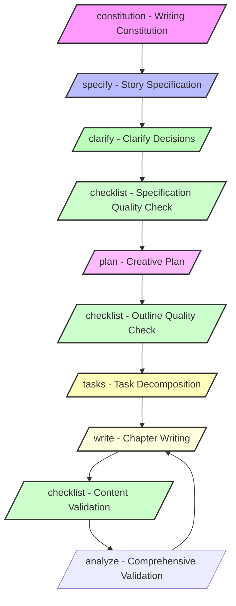
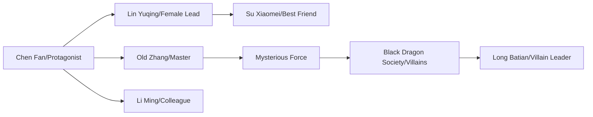

# Writing Workflow Guide

This guide provides a detailed overview of the complete workflow for creating a novel using Novel Writer. Novel Writer references the methodology of Spec-Kit, applying the principles of Specification-Driven Development (SDD) to the field of creative writing.

## Core Philosophy

### Spec-Driven Writing

Referencing Spec-Kit's SDD methodology, Novel Writer adopts a layered, progressive creation model:

1.  **Specification Definition**: First, define the overall specifications of the work (style, theme, structure).
2.  **Plan Development**: Refine the specifications into an executable creative plan.
3.  **Task Decomposition**: Break down the plan into specific writing tasks.
4.  **Iterative Implementation**: Gradually complete each task, continuously iterating and improving.

## Creation Workflow Overview



## Phase One: Preparation

### 1.1 Environment Setup

```bash
# Install the tool
npm install -g novel-writer-cn

# Create a project
novel init My-Novel

# Enter the project directory
cd My-Novel
```

### 1.2 Choose an AI Assistant

Select a suitable AI assistant based on your needs:

| AI Assistant | Strengths | Best For |
|---|---|---|
| Claude | Strong comprehension, high-quality writing | Works with a more literary focus |
| Cursor | Integrated development environment, high efficiency | Writing that requires frequent modifications |
| Gemini | Broad knowledge, rich imagination | Sci-fi, fantasy genres |

### 1.3 Understanding the Project Structure

Referencing Spec-Kit's organization, Novel Writer uses a clear, layered structure:

```
My-Novel/
├── templates/         # Command templates (references spec-kit)
│   └── commands/      # Various creation commands
├── memory/            # Creative memory (style, settings)
│   ├── constitution.md # Writing constitution
│   └── style.md       # Style guide
├── specs/             # Generated works (references spec-kit)
│   └── 001-Story-Name/
│       ├── spec.md    # Story specification
│       ├── plan.md    # Creative plan
│       ├── tasks.md   # Task list
│       ├── chapters/  # Chapter content
│       ├── characters/# Character settings
│       └── worldbuilding/ # World-building
└── scripts/           # Helper scripts
    ├── bash/          # Bash scripts
    └── powershell/    # PowerShell scripts
```

## Phase Two: Creative Planning

### 2.1 Establish the Writing Constitution (/constitution)

The writing constitution is the highest-level set of creative principles. It should clarify:

#### Basic Settings
-   **Genre/Style**: Web novel/Literary/Light novel
-   **Narrative Perspective**: First-person/Third-person/Omniscient
-   **Tense**: Past/Present
-   **Target Audience**: Age group, gender, reading preferences

#### Writing Guidelines
-   **Chapter Length**: Word count range per chapter
-   **Update Frequency**: Daily/Weekly/Irregular
-   **Language Style**: Formal/Colloquial/Internet slang
-   **Descriptive Focus**: Action/Psychology/Environment/Dialogue

#### Example Settings

```text
/constitution
【Core Values】
- The story conveys positive energy and growth.
- Emphasizes the importance of effort and wisdom.

【Quality Standards】
- Every chapter must advance the story.
- Character actions must be consistent with their personality.
- The world-building must be logically self-consistent.

【Creative Style】
- Genre: Web novel, power-fantasy oriented
- Perspective: Third-person limited
- Language: Easy to understand, fast-paced

【Content Guidelines】
- 3000-4000 words per chapter
- Avoid excessive descriptions of violence
- Do not involve sensitive topics
```

### 2.2 Define the Story Specification (/specify)

Define the story specification like a product manager writing a PRD:

#### Core Settings
1.  **One-Liner**: Describe your story in a single sentence.
2.  **Core Conflict**: The central problem the protagonist faces.
3.  **Theme**: The values you want to express.

#### Character Settings
1.  **Protagonist Setting**
    -   Basic info (name, age, occupation)
    -   Personality traits
    -   Character arc
    -   Core motivation

2.  **Important Supporting Characters**
    -   Relationship with the protagonist
    -   Role in the story
    -   Unique characteristics

#### World-Building
1.  **Era/Background**
2.  **Geography**
3.  **Social Rules**
4.  **Power System** (if any)

#### Plot Structure
Use a classic three-act structure or a four-part Kishōtenketsu structure:

1.  **Beginning** (1-25%)
    -   Establish the world
    -   Introduce the protagonist
    -   Introduce the conflict

2.  **Middle** (25-75%)
    -   Conflict escalates
    -   Character development
    -   Relationship changes

3.  **Climax & End** (75-100%)
    -   Final confrontation
    -   Problem resolution
    -   Conclusion

### 2.3 Clarify Key Decisions (/clarify)

The AI will identify ambiguous points in the specification and clarify them with 5 questions:

```text
/clarify
AI: I have identified the following key points that need clarification:
1. Is the protagonist's "golden finger" a system or an inheritance?
2. Is the story's pacing fast like a power-fantasy web novel, or a slow burn?
3. Is the romantic storyline with a single female lead or multiple?
...
```

### 2.4 Specification Quality Check (/checklist)

After clarifying the specifications, use `/checklist Specification Completeness` to confirm the quality of the document:

1.  **Run the command**: `/checklist Specification Completeness` to check the completeness, traceability, and consistency of `spec/specification.md`.
2.  **Identify issues**: The checklist will output uncovered sections, vague descriptions, and conflicts, and save them in the `spec/checklists/` directory.
3.  **Fix and re-check**: Iterate on the specification document based on the issue list until the checklist is fully passed.

This step ensures that subsequent planning and writing are based on a reliable specification document.

### 2.5 Develop the Creative Plan (/plan)

Develop a technical implementation plan based on the clarified specifications:

#### Planning Principles
1.  **Pacing Control**
    -   A balance of tension and release
    -   Reasonable distribution of climaxes
    -   Appropriate use of suspense

2.  **Clear Function**
    -   Every chapter should advance the plot
    -   Avoid filler chapters
    -   Moderate amount of information

3.  **Coherence**
    -   Clear logic between chapters
    -   Foreshadowing and payoffs correspond
    -   Clear timeline

#### Plan Template

```text
/plan
【Volume One: The Novice Village】 (Chapters 1-30)

Chapters 1-3: The Beginning
- Chapter 1: Introduction, showing the protagonist's dilemma.
- Chapter 2: A turning point, obtaining the "golden finger".
- Chapter 3: First use, getting a taste of success.

Chapters 4-10: Exploration Phase
- Chapters 4-6: Understanding the ability, making a plan.
- Chapters 7-8: The first small goal.
- Chapters 9-10: First victory, building confidence.

Chapters 11-20: Growth Phase
- Chapters 11-13: Encountering obstacles, pressure builds.
- Chapters 14-16: Seeking a breakthrough, getting help.
- Chapters 17-18: Resolving the crisis, improving skills.
- Chapters 19-20: A phased victory.

Chapters 21-30: Breakthrough Phase
- Chapters 21-23: A bigger challenge.
- Chapters 24-26: A life-and-death test.
- Chapters 27-29: A desperate counter-attack.
- Chapter 30: Climax of the first volume, a level-up.
```

### 2.6 Task Decomposition (/tasks)

Translate the chapter plan into executable tasks:

#### Task Types
1.  **Writing Tasks**
    -   Specific chapter creation
    -   Scene descriptions
    -   Dialogue writing

2.  **Setting Tasks**
    -   Character development
    -   World-building additions
    -   System rules refinement

3.  **Revision Tasks**
    -   Logic checks
    -   Style unification
    -   Typo correction

#### Priority Setting
-   **P0 Urgent**: Key chapters that affect the main plot.
-   **P1 Important**: Important supporting characters or settings.
-   **P2 Normal**: Regular chapter progression.
-   **P3 Supplementary**: "Nice to have" content.

## Phase Three: Content Creation

### 3.1 Chapter Writing (/write)

#### Pre-writing Preparation
1.  **Review Previous Content**
    -   Check for plot continuity
    -   Confirm foreshadowing and clues
    -   Review character statuses

2.  **Clarify the Goal of the Chapter**
    -   What plot to advance
    -   What information to reveal
    -   What suspense to create

#### Key Writing Points
1.  **Engaging Opening**
    -   Connects to the previous chapter
    -   Quickly gets into the action
    -   Sets a hook

2.  **Mid-section Development**
    -   Advance the main plot
    -   Deepen characters
    -   Provide a moderate amount of information

3.  **The Art of the Ending**
    -   Provide a suitable resolution
    -   Leave some suspense
    -   Lead into the next chapter

#### Example Writing Command

```text
/write Chapter 5: First Glimmer of Talent

Key points for this chapter:
1. The protagonist shows an unusual ability at the company.
2. Catches the attention of the female lead.
3. Plants a clue about the villain's forces.

Specific scenes:
- Opening: A technical problem during the morning meeting.
- Development: The protagonist easily solves it, shocking colleagues.
- Turning point: The female lead asks about it in private.
- Ending: A mysterious phone call mentioning the protagonist's name.

Notes:
- Don't reveal too much of the ability.
- Dialogue should fit a workplace environment.
- Maintain the protagonist's low-key personality.
```

### 3.2 Periodic Quality Checks (/checklist)

In line with the writing pace, run the `/checklist` command periodically to maintain content quality:

1.  **Mid-writing**: After every 5-10 chapters, execute commands like `/checklist Character Consistency 1-10` and `/checklist Plot Logic 1-20` to check characters, plot, and timeline.
2.  **Targeted Checks**: Based on identified issues, choose specific checklists like `/checklist Worldview Consistency` or `/checklist Dialogue Style`.
3.  **Issue Tracking**: Checklist outputs are saved in `spec/checklists/`. After fixing chapters based on the results, run the command again.

Periodic checks with `/checklist` can catch structural and setting deviations before a formal analysis.

### 3.3 Quality Validation (/analyze)

Perform a comprehensive validation every 5 chapters:

```text
/analyze
Seven dimensions are checked:
1. Compliance - Does it follow the constitution?
2. Consistency - Is the logic self-consistent?
3. Completeness - Task completion status.
4. Quality - Evaluation of writing quality.
5. Innovation - Identification of highlights.
6. Readability - Check for fluency.
7. Feasibility - Progress assessment.
```

### 3.4 Character Management

#### Character Cards
Create detailed cards for each important character:

```markdown
# Character: Lin Yuqing

## Basic Information
- Age: 24
- Occupation: Product Manager
- Appearance: Waist-length hair, delicate and pretty

## Personality Traits
- Conscientious and responsible, a perfectionist
- Cold on the outside, warm on the inside, values relationships
- Curious, loves to explore

## Backstory
- Graduated from a top university
- From an ordinary family, relies on her own efforts
- Had a failed relationship in the past

## Speech Patterns
- Speaks concisely and forcefully
- Occasionally uses internet slang
- Unconsciously uses her dialect when angry

## Character Arc
1. Beginning: An ordinary office worker
2. Middle: Awakens a special constitution
3. End: Becomes an important ally
```

#### Character Relationship Map
Maintain a network of relationships between characters:



### 3.5 World-Building

#### Setting Document
Create a detailed world-building document:

1.  **Power System**
    ```
    Cultivation Levels:
    - Qi Refining (Levels 1-9)
    - Foundation Establishment (Early, Middle, Late)
    - Golden Core (Early, Middle, Late)
    - Nascent Soul (Early, Middle, Late)
    ```

2.  **Factions**
    ```
    Righteous:
    - Huaxia Special Affairs Office
    - Alliance of Ancient Martial Arts Families

    Neutral:
    - Underground market
    - Intelligence organizations

    Villainous:
    - Black Dragon Society
    - Evil cultivators from another realm
    ```

3.  **Special Rules**
    ```
    Urban Cultivation Restrictions:
    - Cannot be revealed to ordinary people
    - Scarce spiritual energy, difficult to cultivate
    - Monitored by modern technology
    ```

## Phase Four: Revision and Refinement

### 4.1 Self-Review

#### Checklist
- [ ] Is the plot logic coherent?
- [ ] Is the character's personality consistent?
- [ ] Have all foreshadowing been paid off?
- [ ] Is the pacing appropriate?
- [ ] Are there any major flaws?

### 4.2 AI-Assisted Revision

```text
Help me check the content of chapters 10-15:
1. Is the timeline reasonable?
2. Is the character dialogue consistent with their personality?
3. Are there any logical loopholes?
4. Are there any typos?
```

### 4.3 Handling Reader Feedback

Collect and analyze reader feedback:
1. Plot suggestions
2. Character preferences
3. Pacing feedback
4. Future expectations

## Phase Five: Publication Management

### 5.1 Version Control

Use Git for version management:

```bash
# Daily commits
git add .
git commit -m "Completed Chapter X"

# Create a release branch
git branch release-v1
git checkout release-v1

# Tag important versions
git tag v1.0-Completed
```

### 5.2 Multi-platform Publishing

Prepare formats for different platforms:
1. Web platforms: Chapter-by-chapter release
2. E-books: EPUB/MOBI format
3. Physical publication: Word/PDF format

### 5.3 Update Schedule

Create a sustainable update schedule:
1. Daily updates: At a fixed time each day
2. Stockpiling: Maintain a stockpile of 3-5 chapters
3. Taking a break: Notify readers in advance

## Advanced Techniques

### Multi-threaded Narrative
Manage multiple storylines:
1. Main plot: Protagonist's growth
2. Subplot: Romantic development
3. Hidden plot: The forces behind the scenes

### Ensemble Cast
Balance multiple important characters:
1. Rotating POVs
2. Group events
3. Intersecting interactions

### Foreshadowing Management
Use a table to track foreshadowing:

| Chapter | Foreshadowing | Payoff Chapter | Status |
|---|---|---|---|
| Chapter 3 | Mysterious jade pendant | Chapter 25 | Pending |
| Chapter 7 | Man in black | Chapter 15 | Paid off |
| Chapter 12 | Prophetic poem | Chapter 40 | Pending |

## Common Problems and Solutions

### Q: How to overcome writer's block?

**Solutions**:
1. Review the outline to confirm your direction.
2. Skip the difficult chapter and write a later one.
3. Change your writing environment.
4. Discuss plot possibilities with the AI.

### Q: How to maintain daily updates?

**Suggestions**:
1. Set a fixed writing time.
2. Plan the plot in advance.
3. Maintain a stockpile of 3-5 chapters.
4. Use the Pomodoro Technique.

### Q: How to improve writing quality?

**Methods**:
1. Read more excellent works.
2. Ask the AI to analyze your writing style.
3. Periodically review and revise.
4. Listen to reader feedback.

## Recommended Tools

### Writing Software
- **Typora**: Markdown editor
- **VS Code**: Powerful text editor
- **Scrivener**: Professional writing software

### Auxiliary Tools
- **XMind**: Mind mapping
- **Notion**: Knowledge management
- **Pinterest**: Image resources

### Reference Resources
- **Qidian**: Web novel trends
- **Douban Books**: Book reviews
- **Zhihu**: Writing experience

## Conclusion

Novel Writer provides complete support for the novel writing workflow, with corresponding tools and methods for every stage from conception to publication. Remember:

1.  **Persistence is key** - Continuous creation is more important than perfection.
2.  **Make good use of the AI assistant** - Let the AI be your creative partner.
3.  **Keep learning** - Continuously improve your creative skills.
4.  **Enjoy the process** - Creation itself is the greatest joy.

Happy writing, and may you create a wonderful story!

---

[Back to Home](index.md) | [Quick Start](quickstart.md) | [Installation Guide](installation.md)
